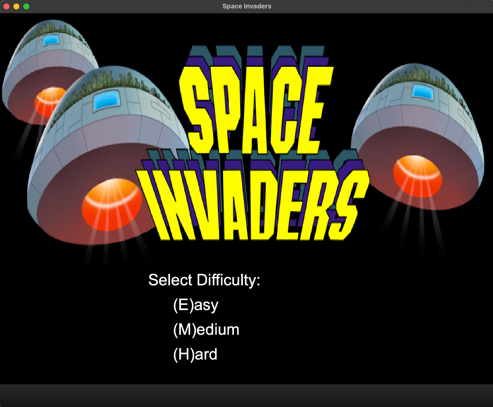
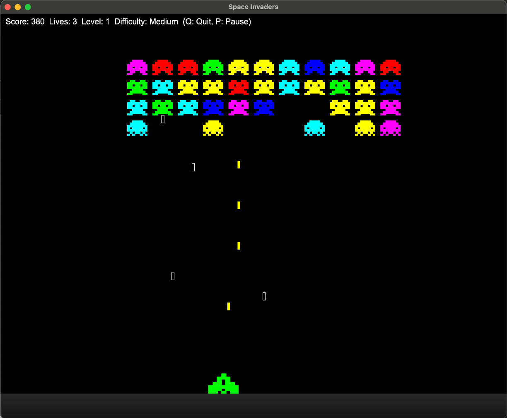
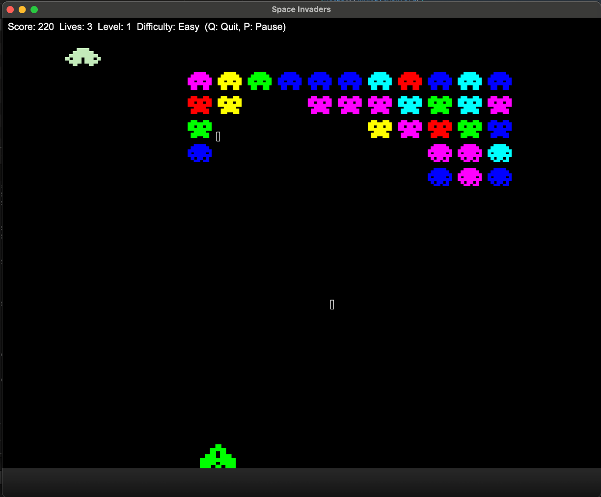

# 🚀 Space Invaders

[](https://www.python.org/)
[](https://pypi.org/project/PyQt6/)
[](LICENSE)

A Python-based implementation of the classic **Space Invaders** arcade game.  
Defend the galaxy, shoot aliens, and rack up a high score!

---

## 🎮 Features
- Classic Space Invaders gameplay  
- Multiple alien types and levels  
- Mystery ship bonus points  
- Player lives and score tracking  
- Smooth animations using PyQt6's QPainter  
- Configurable difficulty levels  
- Well-documented code for learning and experimentation  

---

## 📝 License

This project is licensed under the **BSD 3-Clause License**. See the [LICENSE](LICENSE) file for details.

---

## 🎯 Purpose

The primary goal of this project is to **introduce children and beginners to programming** in a fun and interactive way. By engaging with a familiar game like Space Invaders, learners can explore coding concepts while seeing immediate, visual results.

**Key aspects of the purpose:**

- **Learning through play:**  
  Players can experiment with the code, adjusting values, graphics, and game logic to see how changes affect gameplay.

- **Well-documented code:**  
  Each class, function, and key variable includes comments and doxygen to illustrate Python fundamentals, such as loops, conditionals, object-oriented design, and event handling.

- **Cheat codes and modding:**  
  Built-in cheat codes encourage exploration, allowing learners to modify the game and see results instantly.

- **Problem-solving:**  
  Challenges like surviving waves or shooting aliens can be tied to coding exercises, such as adjusting difficulty, bullet speed, or alien behavior.

- **Gateway to programming:**  
  A stepping stone to advanced topics like graphical programming, Python libraries (PyQt), and eventually AI.

**In short:** This game is a hands-on learning tool designed to spark curiosity, teach coding fundamentals, and empower children to take their first steps into programming.

---

## 🎮 How to Play

Defend the galaxy from invading aliens and aim for a high score!

### Controls
- **Move Left / Right:** Arrow keys ← →  
- **Shoot Bullet:** Spacebar  
- **Restart Game:** R  
- **Quit Game:** Q  

### Gameplay Tips
- Shoot all aliens to clear each level.  
- Avoid alien bullets and prevent aliens from reaching the bottom.  
- Mystery ships appear occasionally—shoot them for bonus points.  
- You start with a limited number of lives; the game ends when all are lost.  
- Levels increase in speed and difficulty as you progress.  

### Scoring
- **Alien hit:** +10 points (varies by alien type)  
- **Mystery ship:** Bonus points  

Stay sharp, aim carefully, and maximize your score!

---

## 📸 Screenshots

  
*Game starting.*

  
*Player shooting aliens.*

  
*Player shooting aliens while the mystery ship moves across the top.*

---

## ⚡ Installation

1. Clone the repository:

```bash
git clone git@github.com:agabrielson/SpaceInvadersGame.git
cd SpaceInvadersGame
```

2. PIP Packages

```
PyQt6==6.7.1           # For GUI and game rendering
numpy==1.26.5          # For numerical computations
pillow==10.2.0         # For image handling (sprites)
```